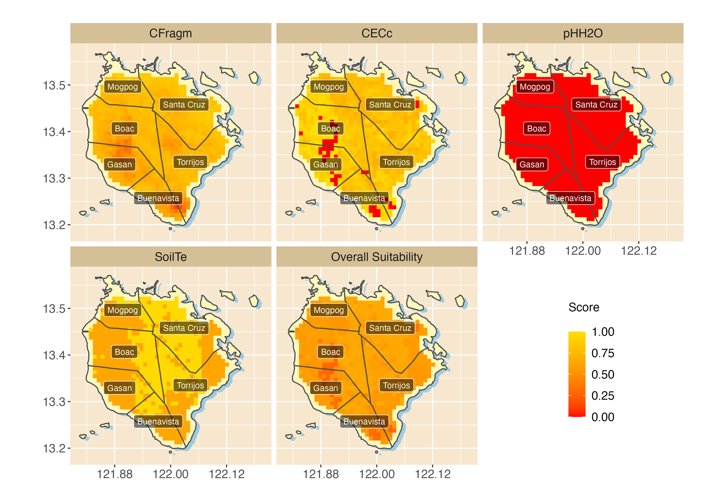
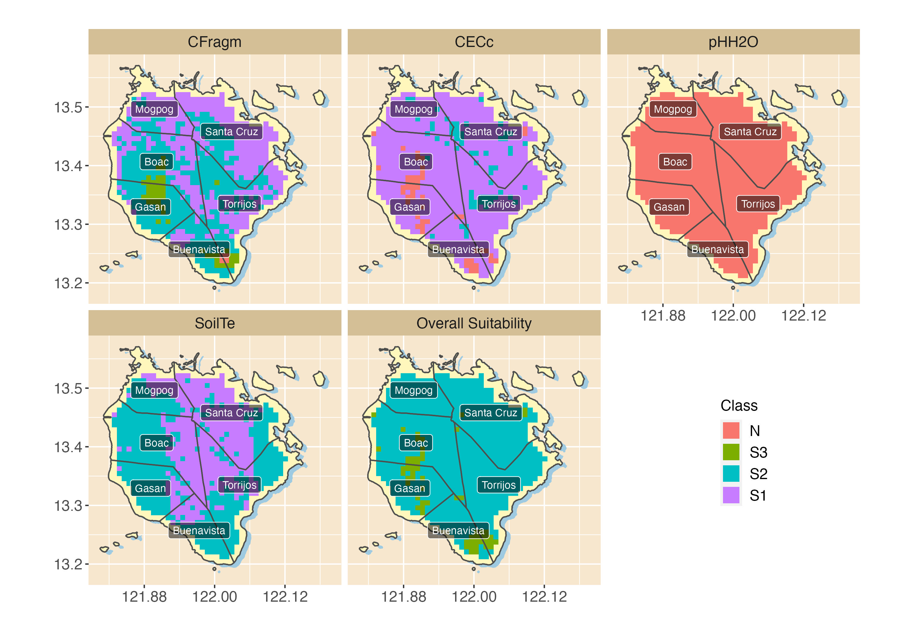

# Summary

The Agricultural Land Use Evaluation System (ALUES) is an R [@rmanual] library developed for evaluating land suitability on different crops. The suitability is assessed based on the 
standard requirements specified in @SysLand. In particular, it evaluates
the land units using the concept of fuzzy logic approach [@ZADEH1965338]. The input data are the 
characteristics of the land units, sub-grouped into rainfall, temperature, 
topography and soil properties. ALUES is inspired by a similar tool for land 
evaluation, the Land Use Suitability Evaluation Tool (LUSET) developed by @YenLuset. The package contains data on crop requirements parameters, and sample land units data 
for Marinduque, Philippines; and, Lao Cai, Vietnam. Finally, the package is 
computationally fast and capable of generating suitability score report.

# Statement of Need
Several computer systems have been developed for agricultural land suitability assessment. Examples of these include ALES [@JohnsonFuzzy], LEIGIS [@KALOGIROU200289], Micro-LEIS [@DELAROSA2004929], and ALSE [@ELSHEIKH201398]. Developed by @JohnsonFuzzy, ALES aims to assist in defining land capability and suitability for farm and regional land use planning. The program is based on soil potential ratings which incorporates biophysical crop simulation modelling, expert systems and risk analysis [@JohnsonFuzzy]. While ALES offers the structure for a wide range of expert knowledge for a quick assessment, the system is not user friendly, and lacks GIS (Geographic Information System) functionality [@ELSHEIKH201398]. The LEIGIS software, on the other hand, is a system based on Food and Agriculture Organization (FAO) methodology designed to support rural planners to determine land suitability of wheat, barley, maize, seed cotton, and sugar beet [@KALOGIROU200289]. The limited number of crops covered and non-inclusion of climate in suitability assessment was considered a major disadvantage of LEIGIS system [@ELSHEIKH201398]. Moving on, Micro-LEIS is another system that uses knowledge-based decision support with GIS and land-data transfer for agro-ecological land evaluation [@DELAROSA2004929]. While Micro-LEIS incorporates different database, information, and knowledge system for land evaluation, it does not allow users to build a personal expert system [@ELSHEIKH201398]. As for the Agriculture Land Suitability Evaluator (ALSE), it offers intelligent system for assessing land suitability of different crops in the tropics and subtropics based on land management expertise, computer modeling, GIS, and multi-criteria analysis [@ELSHEIKH201398]. The main feature of ALSE is its GIS functionality, which allows it to automatically evaluate land suitability based on geo-environmental factors of a specific area using the FAO-SYS framework [@ELSHEIKH201398]. However, the ALSE system uses GIS model builder, which is commercial in nature and operating system dependent. This means additional cost to potential users and limits usability of ALSE in other operating system. It is therefore the goal of this paper to introduce a new system and address some of the limitations of the aforementioned software. This new system is called ALUES, Agricultural Land Use Evaluation System. 

# Data
ALUES comes with 56 crop requirements datasets, each encoded into three separate characteristics: *land and soil*, *water*, and *temperature*. In addition to these, ALUES also comes with 2 land units datasets from two regions: *Marinduque, Philippines*; and, *Lao Cai, Vietnam*.

# Functionality
There  are  two  main  APIs  (Application  Programming Interfaces) defined in the package, these are: `suit`, used for computing the suitability scores and classes of the land units for particular crop of a particular characteristics; and, `overall_suit`, used for computing the overall suitability of the land units for a given characteristics. Further, while ALUES does not necessarily have its own APIs for GIS, its results can be visualized through maps using the extensive libraries of R. Examples of these are shown in Figure \ref{fig:scores} for suitability scores, and Figure \ref{fig:classes} for suitability classes. The code is available in the documentation.

{ width=100% }

{ width=100% }

# Speed
The core algorithms of the library are written in C++, which means ALUES is efficient enough in evaluating large sets of land units. The following shows the elapsed time of computing the suitability scores and classes for the land units of Marinduque, which has 881 units (or observations) in total; and, for the region of Lao Cai, Vietnam, which has 2928 land units.
```{r}
> library(microbenchmark)
> microbenchmark(
+   suppressWarnings(
+     suit("banana", terrain=MarinduqueLT, interval="unbias")
+   )
> )
## Unit: milliseconds
##                                                                           
##  suppressWarnings(
##    suit("banana", terrain = MarinduqueLT, interval = "unbias")
##  )
##       min       lq     mean  median       uq      max neval
##  6.743769 7.201492 8.565446 7.63077 9.120762 20.10044   100
```
For Lao Cai, Vietnam:
```{r}
> microbenchmark(
+   suppressWarnings(
+     suit("banana", terrain=LaoCaiLT, interval="unbias")
+   )
> )
## Unit: milliseconds
##                                                                       
##  suppressWarnings(
##    suit("banana", terrain = LaoCaiLT, interval = "unbias")
##  )
##       min       lq     mean   median       uq     max neval
##  10.53675 11.80469 13.01701 12.29996 13.46417 21.7674   100
```

# References
