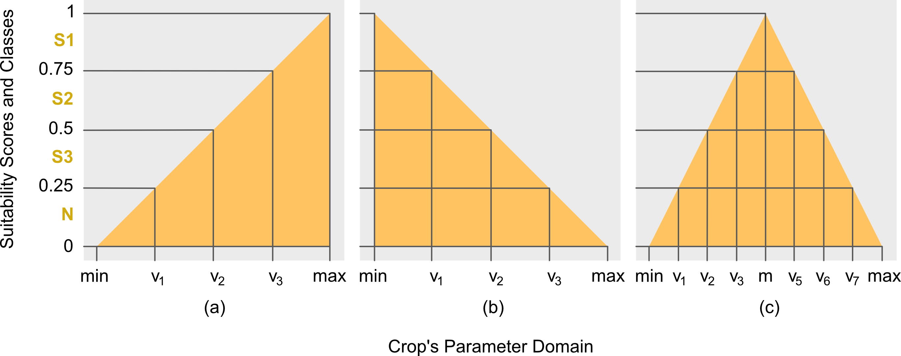
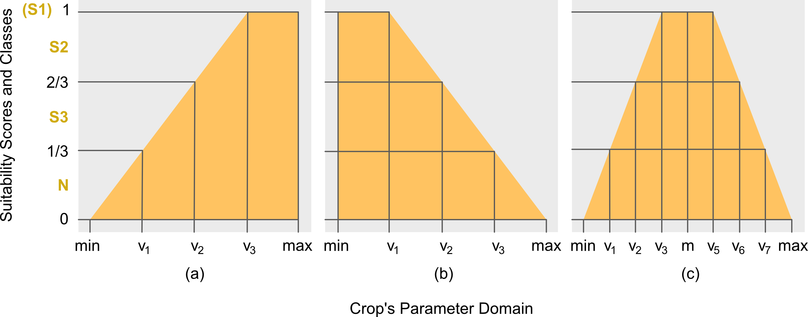
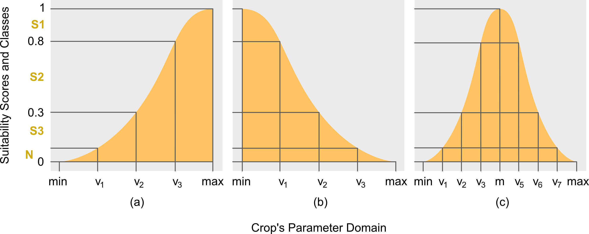

```{r setup, include=FALSE}
knitr::opts_chunk$set(echo = TRUE)
```
## Introduction
It is important to understand the theory used for computing the suitability scores by ALUES, to better interpret the results provided by the APIs. In its simplest form, the task of evaluating land suitability is to map an input characteristics of the land unit into the suitability class of the target parameter or factor. This is done by checking whether the input characteristic is within any of the suitability classes. Consider for example the following data:
```{r}
library(ALUES)
BANANATerrain
```
If an input land unit has terrain with slope of 1 degree, then according to `BANANATerrain` crop requirement, the land unit is *highly suitable* (S1) for farming banana. In this example, the suitability score is the 1 degree slope, since this is the statistics of the land unit directly compared to the intervals of the suitability classes (the columns: s1 - highly suitable, s2 - suitable, s3 - marginally suitable) provided in `BANANATerrain`. Further, suppose the input land unit is known to flood, but only for a short period, then the Flood factor for this land unit is 2 (i.e. short time according to the metric of Flood factor), and according to `BANANATerrain`, the land unit is not *highly suitable* (S1) but rather *suitable* (S2). In this case, the suitability scores of the land unit for factors SlopeD and Flood are 1 and 2, respectively, with the corresponding classes of S1 and S2, respectively. However, these scores can be further summarized into a single value known as the *overall suitability score*, albeit it won't be easy. This is due to the units or metric of the suitability scores, SlopeD is in terms of degrees, so a score of 1, means 1 degree, whereas Flood is in terms of time, so a score of 2, means short time. Two different metrics cannot be combined into one, and this is where the concept of membership function comes in.

The limits of each suitability class specified for each factor in any crop requirement, example `BANANATerrain`, forms what is referred in here as the *unstandardized suitability class intervals*. The term *unstandardized* follows from the fact that the class intervals across factors or parameters have different units, as already emphasized earlier. It would be convenient, therefore, to have a uniform or standardized unit or metric across factors. In this article, this is referred to as the *standardized suitability scores* and *standardized class intervals*. For purpose of brevity and distinction, the *unstandardized suitability class intervals* are now referred to as the *parameter class intervals* or *parameter intervals*, since the former is specified across parameters of any crop requirement. 

The idea of membership function is to standardize the parameter class intervals into a *standardized suitability class*. For purpose of brevity, the latter is now simply referred to as the *suitability class*. The standardization is done by mapping the parameter intervals into a space of unit interval, i.e. $\mathbb{R}_{[0,1]}$. More formally, Definitions 1-3 are the mathematical formulations of the concepts used in this article.

## Membership Function
The membership function (MF) is used to standardized the scores and the parameters intervals across factors. More formally, it is defined in Definition 1 below. There are choices for the shapes of MF, for ALUES there are three: triangular, trapezoidal and Gaussian. Each of the MF can take either *partial* or *complete* face. For triangular, refer to Definitions 4-6; for trapezoidal, refer to Definitions 7-9; and for Gaussian, refer to Definition 10.

## Computing Suitability Score
Referring back to `BANANATerrain`, the parameter intervals for the suitability classes of SlopeD can be written explicitly as follows: [min, 1) for S1; [1, 2) for S2; and [2, 3] for S3. This assignment is based on the classification used by Yen et al. (2006). The *not-suitable* (N) class is not indicated since it is understood that values greater than the S3's upper limit or less than the S1's lower limit (if exists), are assigned to class N. Given this ordering of crop's parameter interval limits, the appropriate MF is the right triangular MF (Fig. \ref{fig:trimf}b). This follows from the fact that the *most-suitable* (or *highly-suitable*) class S1 has interval limits less than the limits of other suitability classes. By doing so, the crop's parameter interval limits are arranged in ascending order in the $x$-axis on points $v_1$, $v_2$ and $v_3$, respectively, as shown in Fig. \ref{fig:trimf}b.

To complete the computation, the min and max limits, which are notated as $v_0$ and $v_p$ (in this case, $v_p=v_4$ since $p=4$), respectively, must therefore be specified. In ALUES, however, these values can be assigned by the users themselves based on their expert opinions. Otherwise, the package will set the $\mathrm{min}:=v_0=0$ and $\mathrm{max}:=v_p:=v_{p-1}+\gamma=v_3+\gamma$ ($\gamma$ is defined in Definition 4) by default. As an example (for SlopeD), the max is mathematically computed as follows:
\begin{align}
    \gamma :=&\;\frac{(v_2-v_1)+(v_3-v_2)}{2}\nonumber\\
    =&\;\frac{(2-1)+(3-2)}{2} = 1,
\end{align}
so that
\begin{align}
\mathrm{max}:=&\;v_p:=v_3+\gamma\nonumber\\
=&\;3+\frac{(2-1)+(3-2)}{2}=4.
\end{align}

## Mathematical Formulation
To present it more formally, this section presents the complete definitions of the theory used in the core algorithms of the package.
<br><br>
**Definition 1 (Membership Function)**. Let $\mathscr{X}\subseteq \mathbb{R}$ and $\mathscr{Y}\subseteq \mathbb{R}_{[0,1]}$, then $\mu:\mathscr{X}\rightarrow\mathscr{Y}$ is a *membership function* (MF).
<br>
*Remark 1*. In the context of land evaluation, $\mathscr{X}$ is the space of the parameter values of the input land unit, and $\mathscr{Y}$ is the space of the suitability scores.
<br><br>
**Definition 2 (Class Intervals)**. Let $u_i\in\mathbb{R}, \forall i\in\mathbb{Z}_{[0,p-1]}$, then the partitions $[u_i,u_{i+1})\in\mathscr{U}$ are defined as the *suitability class intervals*.
<br><br>
**Definition 3 (Parameter Intervals)**. Let $v_i\in\mathbb{R}, \forall i\in\mathbb{Z}_{[0,p-1]}$, then $[v_i,v_{i+1})\in \mathscr{V}$ are defined to be the *crop's parameter intervals*.
<br>
*Remark 2*. $v_i$ is the interval limit of the factor or parameter. $v_0$ and $v_p$ are the minimum and maximum factor limits, respectively, both needs to be computed.

### Triangular Membership Function
```{r, out.width="100%", echo=FALSE}

```
**Definition 4 (Left Triangular)**. Let $x_{jk}\in\mathscr{X}$ be the $j$th land unit's actual value for any target factor $k$, $\forall j \in \mathbb{Z}_{[1,n]}$ and  $\forall k \in \mathbb{Z}_{[1,m]}$, and let $[v_{i},v_{i+1})\in\mathscr{V}$ be the crop's parameter intervals, $\forall i\in\mathbb{Z}_{[0,p-1]}$, then the *lower* or *left triangular* MF, herein notated as $\mu_{\triangle_{\downarrow}}$, is defined as follows:
\begin{equation}
    \mu_{\triangle_{\downarrow}}(x_{jk}):=
    \begin{cases}
        \displaystyle\frac{x_{jk}-\mathrm{min}}{\mathrm{max}-\mathrm{min}},&\mathrm{min}\leq x_{jk}\leq\mathrm{max}\\
        0,&\mathrm{otherwise}
    \end{cases}
\end{equation}
where $\mathrm{min}:= v_0:= v_1-\gamma$, $\mathrm{max}:= v_p:= v_{p-1}+\gamma$, and $\gamma:=\frac{1}{p-2}\sum_{i=1}^{p-2}(v_{i+1}-v_{i})$.
<br>
*Remark 3*. ALUES sets the $\mathrm{min}:=v_0=0$ for all MFs, unless specified by the user explicitly.
<br><br>
**Definition 5 (Right Triangular)**. From Definition 4, the *upper* or *right triangular* MF, herein notated as $\mu_{\triangle_{\uparrow}}$, is defined as follows:
\begin{equation}\label{eq:rtri}
    \mu_{\triangle_{\uparrow}}(x_{jk}):=
    \begin{cases}
        \displaystyle\frac{\mathrm{max}-x_{jk}}{\mathrm{max}-\mathrm{min}},&\mathrm{min}\leq x_{jk}\leq\mathrm{max}\\
        0,&\mathrm{otherwise}
    \end{cases}.
\end{equation}
<br><br>
**Definition 6 (Full Triangular)**. From Definition 4 and 5, the *full triangular* MF, herein notated as $\mu_{\triangle}$, is defined as follows:
\begin{equation}
    \mu_{\triangle}(x_{jk}):=
    \begin{cases}
        0,&x_{jk}\leq 0\\
        \mu_{\triangle_{\downarrow}}(x_{jk}),&\mathrm{min}\leq x_{jk}\leq\mathrm{m}\\
        \mu_{\triangle_{\uparrow}}(x_{jk}),&\mathrm{m}<x_{jk}<\mathrm{max}\\
        0,&x_{jk}\geq \mathrm{max}
    \end{cases}
\end{equation}
where $\mathrm{m}:= \frac{v_{i}^{*}+v_{i+1}^*}{2}$ such that $v_i^*<\mathrm{m}<v_{i+1}^*$, and $v_i^{*}$ and $v_{i+1}^*$ are interval limits right next to m.

### Trapezoidal Membership Function
```{r, out.width="100%", echo=FALSE}

```
**Definition 7 (Left Trapezoidal)**. From Definition 4, the *lower* or *left trapezoidal* MF, herein notated as $\mu_{\bigtriangledown_{\downarrow}}$, is defined as follows:
\begin{equation}
    \mu_{\bigtriangledown_{\downarrow}}(x_{jk}):=
    \begin{cases}
        \displaystyle\frac{x_{jk}-\mathrm{min}}{\mathrm{max}-\mathrm{min}},&\mathrm{min}\leq x_{jk}\leq v_{p-1}\\
        1,&v_{p-1}<x_{jk}\leq \mathrm{max}\\
        0,&\mathrm{otherwise}
    \end{cases},
\end{equation}
where $\mathrm{min},\mathrm{max}$ and $\gamma$ are the same as in Definition 4.
<br><br>
**Definition 8 (Right Trapezoidal)**. From Definition 4, the *upper* or *right trapezoidal* MF, herein notated as $\mu_{\bigtriangledown_{\uparrow}}$, is defined as follows:
\begin{equation}
    \mu_{\bigtriangledown_{\uparrow}}(x_{jk}):=\begin{cases}
        1,&\mathrm{min}\leq x_{jk}\leq v_1\\
        \displaystyle\frac{\mathrm{max}-x_{jk}}{\mathrm{max}-\mathrm{min}},&v_1<x_{jk}\leq\mathrm{max}\\
        0,&\mathrm{otherwise}
    \end{cases}.
\end{equation}
<br><br>
**Definition 9 (Full Trapezoidal)**. From Definition 7 and 8, the *full trapezoidal* MF, herein notated as $\mu_{\bigtriangledown}$, is defined as follows:
\begin{equation}
    \mu_{\bigtriangledown}(x_{jk}):=
    \begin{cases}
        \mu_{\bigtriangledown_{\downarrow}}(x_{jk}),&\mathrm{min}\leq x_{jk}\leq v_i^*\\
        1,&v_i^*<x_{jk}\leq v_{i+1}^*\\
        \mu_{\bigtriangledown_{\uparrow}}(x_{jk}),&v_{i+1}^*<x_{jk}\leq\mathrm{max}\\
        0,&\mathrm{otherwise}
    \end{cases},
\end{equation}
where $v_i^*$ and $v_{i+1}^*$ are defined in Definition \ref{def:trimf}.

### Gaussain Membership Function
```{r, out.width="100%", echo=FALSE}

```

**Definition 10 (Gaussian MF)**. From Definition 4, the *full Gaussian* MF, herein notated as $\mu_{\curlywedge}$, is defined as follows:
\begin{equation}
    \mu_{\curlywedge}(x_{jk}):=\exp\left[-\frac{(x_{jk}-\alpha)^2}{2\sigma^2}\right],
\end{equation}
where $\alpha\in(-\infty,\infty)$ and $\sigma\in(0,\infty)$.

*Remark 4*. For partial Gaussian MF, however, the adjustment is done using the location hyperparameter. In particular, if $\alpha=\mathrm{min}$, then the model is right Gaussian function. However, if $\alpha=\mathrm{max}$, then the model is left Gaussian function. 

### Overall Suitability
**Definition 11 (Overall Suitability)**. Let $y_{jk}\in\mathscr{Y}$ be the $j$th land unit's suitability score for any target factor $k$, $\forall j\in \mathbb{Z}_{[1,n]}$ and $\forall k\in\mathbb{Z}_{[1,m]}$; and let $w_{k}\in\mathbb{N}_{[1,3]}$ be the weight of the $k$th factor; then, $\mathbf{y}_{j}:=[y_{j1},\cdots,y_{jm}]^{\text{T}}\in\mathbb{R}^m$ is the vector suitability scores of all target factors, and $\mathbf{w}:=[w_1,\cdots,w_m]^{\text{T}}\in\mathbb{N}^m$ is the corresponding weights vector. The *overall suitability using average aggregation*, herein notated as $\bar{\mu}$, of a given land unit is computed as follows:
\begin{equation}\label{eq:overallsuit}
\bar{\mu}(\mathbf{y}_j|\mathbf{w}):= \mathbf{y}_j^{\mathrm{T}}\lambda(\mathbf{w})=\sum_{\forall k}y_{jk}*\lambda (w_k),
\end{equation}
where $\lambda(w_k):= \frac{\eta-w_k}{\delta}, \eta:=\sum_{\forall k} w_k$ and $\delta:=\sum_{\forall k}(\eta - w_k)$. For *minimum* (notated as $\tilde{\mu}$) and *maximum* (notated as $\hat{\mu}$) aggragation functions, the following are the definitions:
\begin{equation}
    \tilde{\mu}(\mathbf{y}_j):=\min(\{y_{j1}, \cdots,y_{jm}\}),
\end{equation}
and
\begin{equation}
    \hat{\mu}(\mathbf{y}_j):=\max(\{y_{j1}, \cdots,y_{jm}\}).
\end{equation}

### References
* Yen, B., Pheng, K., & Hoanh, C. (2006).  LUSET:Land Use Suitability Evaluation Tool User’s Guide.International Rice Research Institute