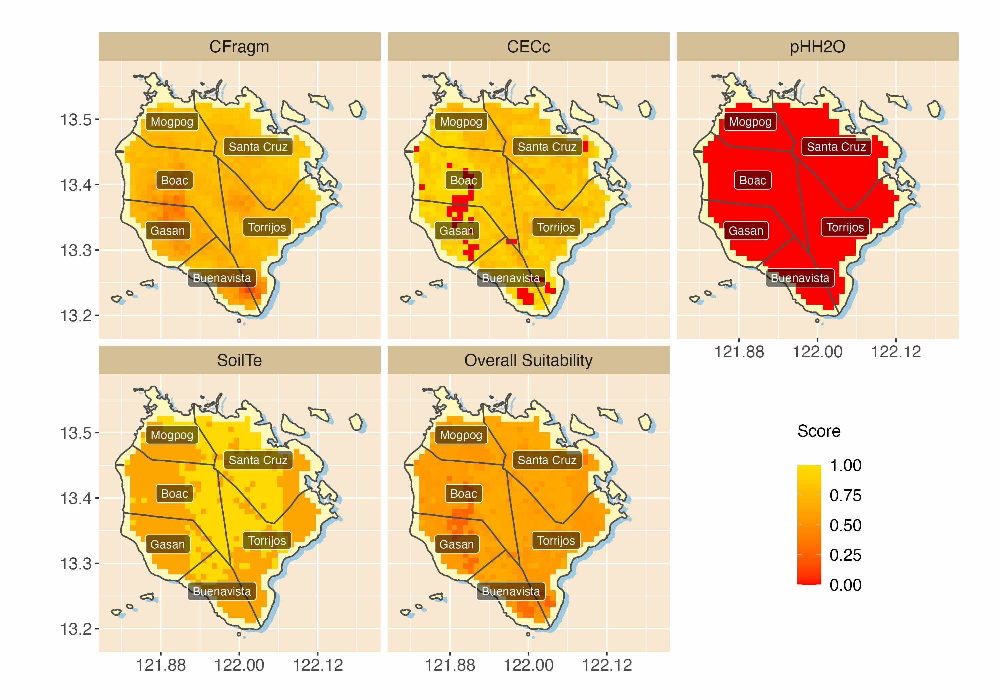
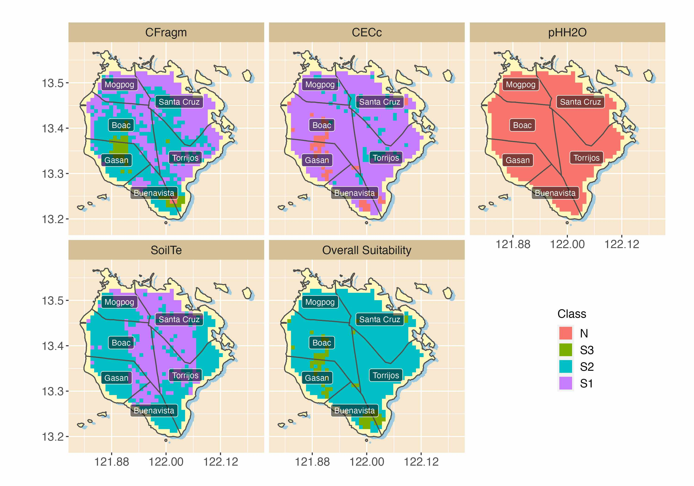

```{r setup, include=FALSE}
knitr::opts_chunk$set(echo = TRUE)
```
While ALUES can generate tables for suitability scores and classes, it can also take advantage of the rich mapping library of R. The main requirement of course is the availability of the longitude and latitude for each of the land units. This is possible for Marinduque as it has spatial variables.

## Suitability scores and classes
Suppose we want to evaluate the land units for banana, then:
```{r}
library(ALUES)
y <- MarinduqueLT
banana_suit <- suit("banana", terrain=y)
banana_ovsuit <- overall_suit(banana_suit[["soil"]], method="average")
```

## Generate maps
There are several ways to generate maps in R, but the following uses ggmap library:
```{r, eval=FALSE}
library(ggmap)
library(raster)
library(reshape2)
map_lvl0 <- getData("GADM", country = "PHL", level = 0)
map_lvl2 <- getData("GADM", country = "PHL", level = 2)

prov <- map_lvl2[map_lvl2$NAME_1 == as.character("Marinduque"),]
munic_coord <- coordinates(prov)
munic_coord <- data.frame(munic_coord)
munic_coord$label <- prov@data$NAME_2

val <- banana_suit[["soil"]][[2]]
val["Overall Suitability"] <- banana_ovsuit[,1]
d_map <- melt(as.matrix(val))
d_map$Lon <- rep(y$Lon, ncol(val)); d_map$Lat <- rep(y$Lat, ncol(val))

fill <- "#FFF7BC"; shadow <- "#9ECAE1"; ncol <- 3; size <- 3; alpha <- 1
text_opts <- list(alpha = 1, angle = 0, colour = "black", family = "sans", fontface = 1, lineheight = 1, size = 3)
labels <- list(title = "", xlab = "", ylab = "")

p1 <- ggplot() + geom_polygon(data = prov, aes(long + 0.008, lat - 0.005, group = group), fill = shadow) + 
  geom_polygon(data = prov, aes(long, lat, group = group), colour = "grey50", fill = fill) +
  geom_tile(aes(x = Lat, y = Lon, fill = value), data = d_map, size = size, alpha = alpha) +
  facet_wrap(~ Var2, ncol = ncol) +
  geom_polygon(data = prov, aes(long, lat, group = group), colour = "#4E4E4C", alpha = 0) +
  geom_label(data = munic_coord, aes(x = X1, y = X2, label = label), alpha = 0.5,
            angle = text_opts$angle, colour = "white", fill = "black", family = text_opts$family,
            fontface = text_opts$fontface,
            lineheight = text_opts$lineheight, size = text_opts$size) +
  coord_equal() + ggtitle(as.character(labels$title)) + xlab(as.character(labels$xlab)) + ylab(as.character(labels$ylab)) +
  scale_fill_gradientn(name = "Score\n", colors = c("red", "#FFDF00")) +
  scale_x_continuous(breaks = round(seq(min(d_map$Lat) + 0.05, max(d_map$Lat), len = 3), 2)) +
  theme(panel.background = element_rect(fill = '#F7E7CE'), 
        strip.background = element_rect(fill = "#D4BF96"),
        strip.text.x = element_text(size = 12),
        axis.text.x = element_text(size=12), 
        legend.text=element_text(size=12),
        legend.title=element_text(size=12),
        axis.text.y = element_text(size=12), legend.position = c(0.85, 0.25))
p1
```
```{r, out.width="100%", echo=FALSE}

```
And for suitability classes:
```{r, eval=FALSE}
val <- banana_suit[["soil"]][[3]]
val["Overall Suitability"] <- banana_ovsuit[,2]
d_map <- melt(as.matrix(val))
d_map$Lon <- rep(y$Lon, ncol(val)); d_map$Lat <- rep(y$Lat, ncol(val))

d_map$Class <- factor(d_map$value, levels=c("N", "S3", "S2", "S1"))

p1 <- ggplot() + geom_polygon(data = prov, aes(long + 0.008, lat - 0.005, group = group), fill = shadow) + 
  geom_polygon(data = prov, aes(long, lat, group = group), colour = "grey50", fill = fill) +
  geom_tile(aes(x = Lat, y = Lon, fill = Class), data = d_map, size = size, alpha = alpha) +
  facet_wrap(~ Var2, ncol = ncol) +
  geom_polygon(data = prov, aes(long, lat, group = group), colour = "#4E4E4C", alpha = 0) +
  geom_label(data = munic_coord, aes(x = X1, y = X2, label = label), alpha = 0.5,
             angle = text_opts$angle, colour = "white", fill = "black", family = text_opts$family,
             fontface = text_opts$fontface,
             lineheight = text_opts$lineheight, size = text_opts$size) +
  coord_equal() + ggtitle(as.character(labels$title)) + xlab(as.character(labels$xlab)) + ylab(as.character(labels$ylab)) +
  scale_colour_discrete(name = "Class\n", breaks=c("N", "S3", "S2", "S1"), labels=c("N", "S3", "S2", "S1")) +
  scale_x_continuous(breaks = round(seq(min(d_map$Lat) + 0.05, max(d_map$Lat), len = 3), 2)) +
  theme(panel.background = element_rect(fill = '#F7E7CE'), 
        strip.background = element_rect(fill = "#D4BF96"),
        strip.text.x = element_text(size = 12),
        axis.text.x = element_text(size=12), 
        legend.text=element_text(size=12),
        legend.title=element_text(size=12),
        axis.text.y = element_text(size=12), legend.position = c(0.85, 0.25))
p1
```
```{r, out.width="100%", echo=FALSE}

```